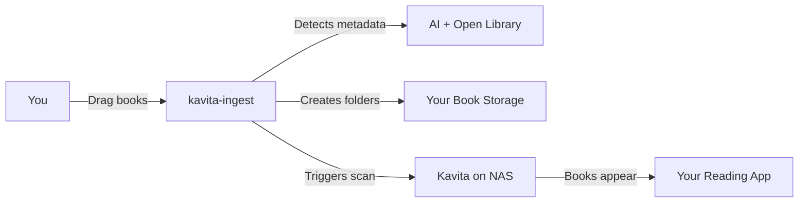
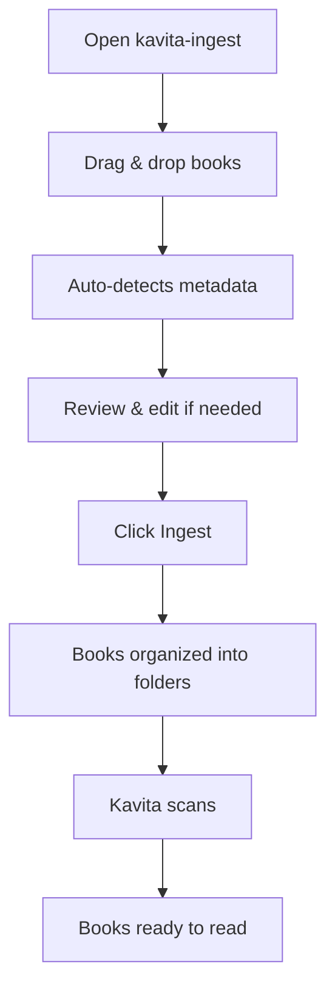

# Kavita Ingest Manager

> **Your problem:** You've collected hundreds of books over the years. Getting them into Kavita on your NAS is a pain.

You love Kavita for reading your book collection. But there's a problem: **adding books to Kavita requires a specific folder structure that's tedious to create manually.**

Every time you get new books, you find yourself:
- Figuring out which library folder they belong to
- Creating the right subfolder structure
- Renaming and organizing files
- Writing custom scripts to cobble it all together

**There must be a better way.**

---

## What This Does

This tool solves your problem in one simple step:

1. **Drag & drop** your book files (PDF, EPUB)
2. **Review** the auto-detected metadata (title, author, subject, which library)
3. **Click "Ingest"** - it creates the folders, renames files, and tells Kavita to scan

That's it. No more manual folder structure. No more cobbling scripts.

---

## How It Works



### The Magic Part

You have books scattered everywhere. This tool:
- **Reads the actual content** of your PDFs/EPUBs (not just the filename)
- **Looks up metadata** from Open Library (free) or AI (optional, for better accuracy)
- **Figures out which library** each book belongs to (Physics? AI? Mathematics?)
- **Creates the exact folder structure** Kavita expects
- **Tells Kavita to scan** so the books show up immediately

---

## Your Setup

### Before: The Problem

```
Your Downloads/
├── book1.pdf
├── book2.epub
├── book3.pdf
└── ...messy pile of books...
```

You need to manually organize these into:

```
/mnt/books/                    # Your NAS book storage
├── Physics/                   # Library 1
│   ├── Quantum Mechanics/
│   │   └── book1.pdf
│   └── Classical Mechanics/
├── AI/                        # Library 2
│   ├── Machine Learning/
│   │   └── book2.epub
│   └── Deep Learning/
└── Mathematics/               # Library 3
    ├── Calculus/
    └── Linear Algebra/
```

### After: The Solution

1. Drag all your messy files into kavita-ingest
2. Click "Ingest"
3. Done. The tool creates the folders, puts books in the right place, and Kavita scans them.

---

## Installation

### Option 1: Manual (Your Computer)

```bash
# Install uv (one-time)
pip install uv

# Download the tool
cd kavita-ingest
uv sync

# Run it
uv run python app.py
```

Open `http://localhost:8000` in your browser.

### Option 2: Docker on Your NAS

```bash
# On your NAS
cd kavita-ingest
nano docker-compose.yml
```

Edit the volume mount to point to your books:
```yaml
volumes:
  - /Volume1/kavita/books:/books  # Change /Volume1/kavita/books to your actual path
```

Then start:
```bash
docker-compose up -d
```

**Important:** In the web UI settings, set **Books Root Path** to `/books` (the container path, not the host path). The app runs inside Docker and can only see mounted paths.

---

## Setup (One-Time)

### 1. Connect to Kavita

- **Kavita URL**: `http://your-nas:5000`
- **API Key**: Get this from Kavita Settings → API
- Click "Test Kavita" to verify

### 2. Tell It Where Your Books Are

- **Books Root**: Where your book folders live on your NAS
  - Example: `/mnt/books` or `\\NAS\books`
  - This is where the tool will create the library folders

### 3. Map Your Libraries

You have libraries in Kavita (Physics, AI, Mathematics, etc.). Tell the tool where each one lives:

- Click "Detect Paths" to auto-scan your Books Root
- Or manually map: "Physics library → `/mnt/books/Physics`"

### 4. (Optional) Enable AI for Better Metadata

If you want smarter library selection:
- **Provider**: `deepseek` (cheap, good quality)
- **Model**: `deepseek-chat`
- **API Key**: Get one from [DeepSeek](https://platform.deepseek.com/)
- **Base URL**: `https://api.deepseek.com/v1`

Click "Test LLM" to verify.

---

## Using It



1. **Upload**: Drag your book files (PDF, EPUB) into the browser
2. **Review**: The tool shows you what it found (title, author, which library it chose)
3. **Edit**: Change anything that's wrong
4. **Ingest**: Click the button
5. **Done**: Books are now in Kavita, ready to read

---

## What Makes It Smart

### Content-Aware Library Selection

Most tools just look at the filename. This tool **reads the actual content**:

- **Filename**: "Optimization Algorithms.pdf"
  - ❌ Other tools: Guesses Math library (wrong!)
  - ✅ This tool: Reads content → sees "machine learning", "neural networks" → puts in AI library (correct!)

### Dual Metadata Sources

- **Open Library** (free): Good for well-known books
- **AI** (optional): Better for obscure books, smarter library selection
- **Both in parallel**: Get the best of both worlds

---

## Your Libraries, Your Way

You define your libraries in Kavita:
- Physics
- AI
- Mathematics
- Computer Science
- Whatever you want

The tool learns your library structure and puts books in the right place automatically.

---

## FAQ

**Q: Does this modify my original files?**
A: No, it copies them to the organized folder structure. Your originals stay where they are.

**Q: What if it gets the library wrong?**
A: You can edit the library selection before ingesting. The tool remembers your corrections.

**Q: Do I need AI?**
A: No. Open Library works fine for most books. AI is optional for better accuracy.

**Q: Can I run this on my NAS?**
A: Yes! Docker deployment is designed for NAS (Synology, QNAP, etc.).

**Q: Will this work with my existing book collection?**
A: Yes. Point it at your existing folders and it will organize new books alongside your old ones.

---

## License

MIT

---

**Stop organizing books manually. Start reading.**